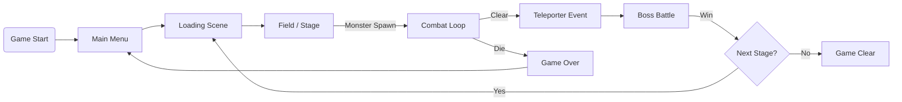
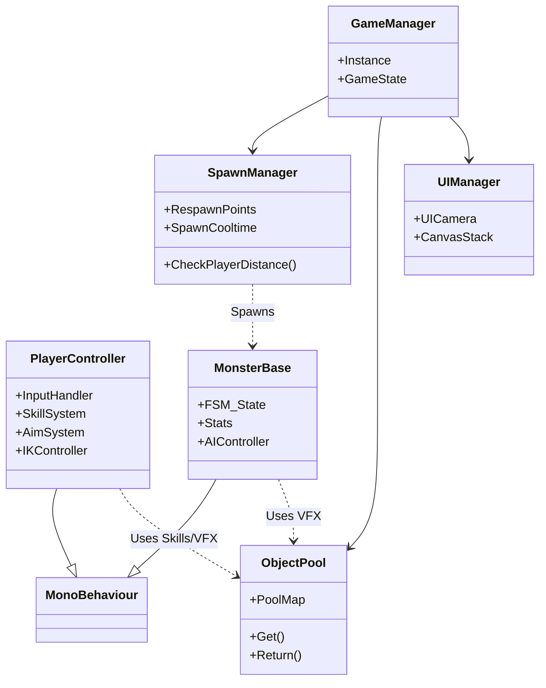

# Risk of Rain 2 Clone - Unity 3D Portfolio

## 목차 (Table of Contents)

- [프로젝트 개요](#-프로젝트-개요)
  - [개발 동기 및 목표](#개발-동기-및-목표)
- [주요 역할 및 성과](#-주요-역할-및-성과)
- [시스템 아키텍처](#-시스템-아키텍처)
  - [1. Game Flowchart](#1-game-flowchart)
  - [2. Class Diagram](#2-class-diagram)
- [주요 구현 내용](#-주요-구현-내용)
  - [1. Aim System](#1-aim-system)
  - [2. UI System](#2-ui-system)
  - [3. Respawn System](#3-respawn-system)
  - [4. Object Pool](#4-object-pool)
  - [5. Item System](#5-item-system)
  - [6. Player Skill](#6-player-skill)
  - [7. Shader](#7-shader)
  - [8. FSM & Sound System](#8-fsm--sound-system)
- [성능 최적화](#-성능-최적화)
- [기술 스택](#-기술-스택)

---

##  프로젝트 개요

**프로젝트명**: Risk of Rain 2 Clone  
**엔진**: Unity 2020 (C#)  
**장르**: 3D Roguelike / TPS  
**개발 기간**: [2024.08.09 ~ 2024.11.30]  
**개발 인원**: 1인 개발 (개인 프로젝트)

### 개발 동기 및 목표

#### 배경
Risk of Rain 2 (2020)의 아트 리소스를 활용하여, Unity C#을 이용한 3D 로그라이크 게임 개발 과정을 학습하고 구현했습니다.

#### 핵심 목표
1.  **로그라이크 장르 이해**: 랜덤 요소, 리스폰, 아이템 파밍 등 장르적 특성 구현
2.  **기술적 도전**:
    *   IK(Inverse Kinematics)를 활용한 자연스러운 캐릭터 애니메이션
    *   다양한 자료구조와 알고리즘(Object Pooling, FSM 등)의 실전 적용
3.  **최적화**: 모바일/PC 환경을 고려한 렌더링 및 메모리 최적화

---

##  주요 역할 및 성과

*   **Aim System**: IK와 선형보간을 결합하여 자연스러운 상체 회전 및 조준 시스템 구현
*   **UI Architecture**: Camera Stacking을 활용한 3D/2D UI 분리 및 최적화
*   **Dynamic Respawn**: 플레이어 위치 기반의 동적 몬스터 스폰 및 쿨타임 관리 시스템
*   **Optimization**: GPU Instancing, Batching 등을 통한 드로우콜 최적화

---

##  시스템 아키텍처

### 1. Game Flowchart

게임의 전체적인 흐름도입니다.

### 2. Class Diagram

핵심 클래스 간의 관계도입니다.

---

##  주요 구현 내용

### 1. Aim System

**문제 상황**
*   마우스 회전에 따라 캐릭터의 팔과 시선(Aim)이 자연스럽게 회전해야 함.
*   단순 IK Rigging 적용 시 움직임이 부자연스럽고 딱딱함.

**해결 방안**
*   **Focus Point**: Aim 방향에 보이지 않는 빈 구체(FocusPoint)를 생성.
*   **선형 보간 (Lerp)**: 마우스 입력에 따라 FocusPoint를 부드럽게 이동시키고, 캐릭터가 이를 바라보도록 설정.
*   **Animation Blending**: Horizontal/Vertical 움직임을 2등분하여 Blend Tree로 구성, 카메라의 오일러 각도를 로컬 좌표로 변환(0~360 → -180~180)하여 적용.

🔗 [상세 기술 블로그 링크](https://enom01.tistory.com/116)

### 2. UI System

**문제 상황**
*   UI Canvas가 Overlay 모드일 때 Emissive 효과나 Masking, 3D Object와의 깊이 처리 제약 발생.

**해결 방안**
*   **Camera Stacking**: Main Camera와 UI Camera를 분리.
*   **Culling Mask**:
    *   Main Camera: UI Layer 제외하고 렌더링.
    *   UI Camera: UI Layer만 렌더링 (Depth 우선순위 높음).
*   **결과**: UI Camera를 Overlay로 설정하고 Main Camera 스택에 추가하여, 3D UI, Emissive 효과, UI 가려짐 문제 해결.

### 3. Respawn System

**구현 목표**
*   플레이어 주변에서만 몬스터 스폰 (최적화 및 게임플레이).
*   플레이어와 멀어지면 추격, 특정 지점 무한 스폰 방지(쿨타임).

**해결 방안**
*   **Sphere Detection**: 플레이어 주변에 감지 콜라이더(Sphere) 부착.
*   **Dynamic Activation**:
    *   감지 콜라이더 내의 Respawn Point만 활성화.
    *   활성화된 포인트에서 `0 ~ CoolTime` 간격으로 몬스터 스폰.
    *   플레이어가 멀어지면(Overlap End) 포인트 비활성화.

### 4. Object Pool

**구현 내용**
*   **Map 자료구조**: Inspector에서 등록된 프리팹을 Key로 하여 Pool 관리.
*   **Particle System**: 자주 생성/파괴되는 파티클 이펙트(VFX)를 풀링.
*   **Auto Return**: 파티클의 `duration`이 끝나면 자동으로 Pool로 반환되도록 구현.

### 5. Item System

**구현 내용**
*   **ScriptableObject**: 아이템 데이터(이름, 능력치, 모델 등)를 SO로 관리하여 데이터 주도적 설계.
*   **Visual Attachment**: 아이템 획득 시 캐릭터 모델의 지정된 소켓(Socket) 위치에 해당 아이템 모델을 스폰/부착하여 시각적 피드백 제공.

### 6. Player Skill

**스킬 구성**
*   **기본 공격 (LMB)**: 기본 배율 100% 데미지.
*   **보조 스킬 (RMB)**:
    *   기본 배율 150%.
    *   **관통 시스템**: 몬스터 관통 시 데미지 20% 증가 (최대 6회, 최대 270%).
*   **특수 스킬 (R)**:
    *   기본 배율 180% (3회 사격).
    *   **CC기**: 일반 몬스터 명중 시 3초 스턴.

### 7. Shader

**구현 내용**
*   **Laser Shader**:
    *   Noise Mask를 사용하여 지직거리는 효과 구현.
    *   경고 레이저(흐림) vs 실제 레이저(선명함) 구분.
*   **Environment Shader**:
    *   플레이어와의 거리에 따라 나무, 잔디 등의 색상이 변화하는 효과 구현.

### 8. FSM & Sound System

**FSM (Finite State Machine)**
*   몬스터 AI를 상태 패턴으로 구현.
*   `Idle` ↔ `Trace` (플레이어 감지) ↔ `Attack` (공격 범위 내) 상태 전이 로직.

**Sound System**
*   **AudioManager**: 싱글톤 매니저로 사운드 리소스 관리.
*   **Audio Mixer**: BGM, SFX, UI 사운드 그룹 분리 및 볼륨 조절.
*   **Spatial Audio**: 3D 사운드 설정을 통해 거리에 따른 소리 감쇠 적용.

---

##  성능 최적화

*   **Batching**:
    *   **Dynamic Batching**: 움직이는 소형 오브젝트 배칭.
    *   **Static Batching**: 움직이지 않는 배경 오브젝트 배칭.
    *   **SRP Batcher**: 셰이더 변수 최적화.
*   **GPU Instancing**: 동일한 메쉬(나무, 풀 등)를 대량으로 렌더링할 때 사용.
*   **Occlusion Culling**: 카메라에 보이지 않는 오브젝트 렌더링 제외.
*   **LOD (Level of Detail)**: 거리에 따라 나무, 돌, 잔디의 모델 디테일 조절.

---

## 기술 스택

*   **Engine**: Unity 2020.3 LTS
*   **Language**: C#
*   **IDE**: Visual Studio 2022
*   **Version Control**: Git / GitHub
*   **Tools**: Blender (리소스 수정), Photoshop (UI 리소스)
